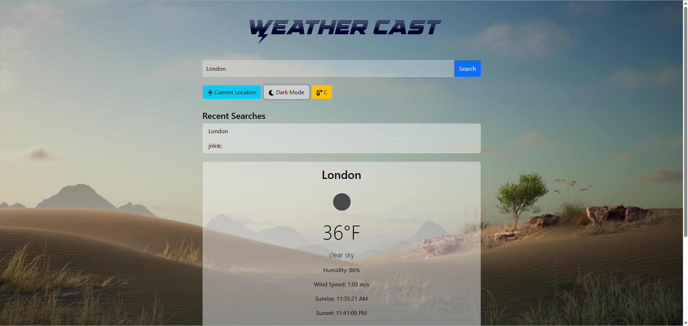
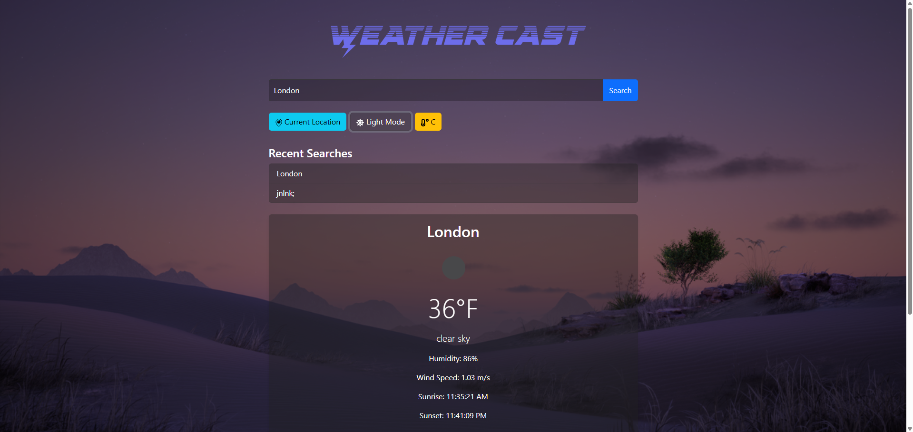

# Weather Cast - A Weather Forecasting App 🌤️

A modern weather app built with **React**, **React Query**, and **Zustand**. It provides real-time weather data, a 4-day forecast, and supports light/dark mode.

## Features ✨

- **Current Weather**: Temperature, weather condition, humidity, wind speed, sunrise, and sunset times.
- **4-Day Forecast**: Weather predictions for the next 4 days.
- **Light/Dark Mode**: Toggle between light and dark themes.
- **Unit Conversion**: Switch between Celsius and Fahrenheit.
- **Geolocation**: Fetch weather for your current location.
- **Recent Searches**: Keeps track of recently searched cities.
- **Dynamic Icons**: Icons for location, temperature, and theme toggles.

## Technologies Used 🛠️

- **Frontend**: React, React Query, Zustand, Bootstrap, Framer Motion
- **API**: OpenWeatherMap API
- **Icons**: React Icons

## Screenshots 📸

### Light Mode

### Dark Mode

## Live Demo 🌐

Check out the live demo of the app: [Weather Cast](https://weathercast.netlify.app)

Enjoy the app! 🌦️